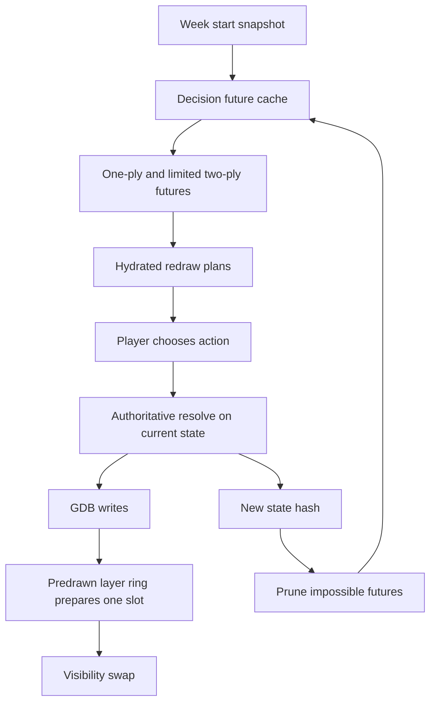
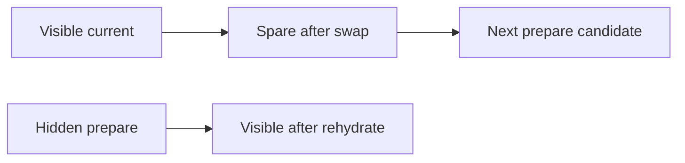
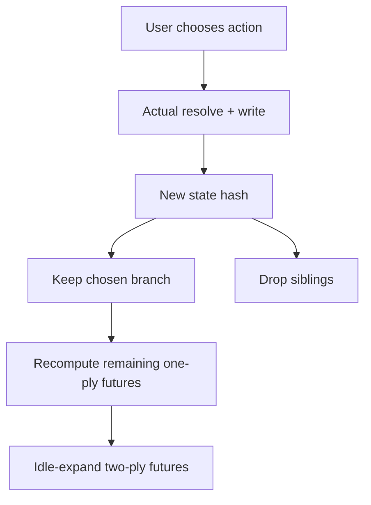
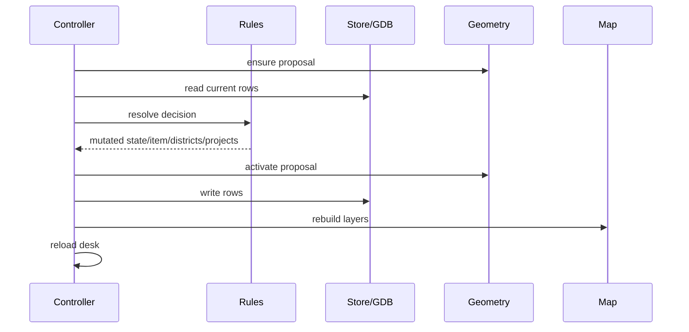
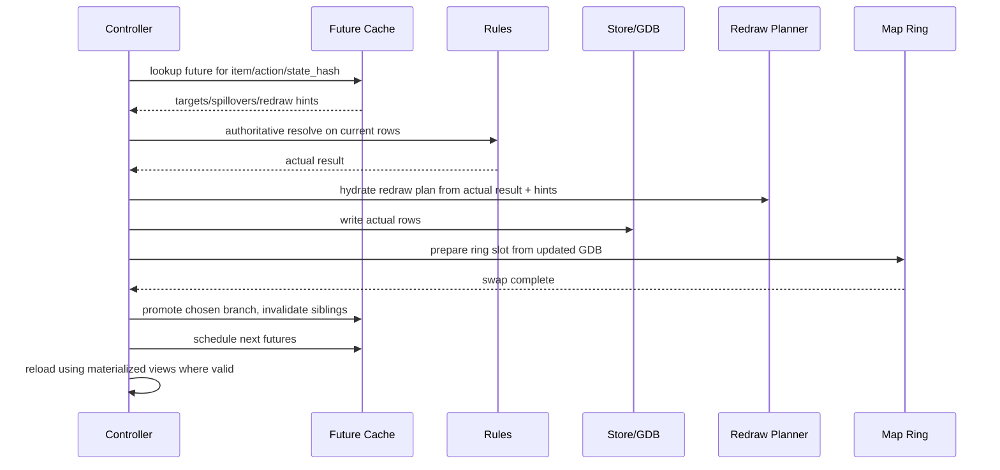

# Precomputed Decision Cache Spike Design

## Purpose

This spike explores a larger architecture refactor for Permit Office performance.
The current command flow is correct but broad: every click reads GDB rows,
resolves the decision, writes rows, then asks ArcGIS to rebuild or refresh the
affected map layers. Recent redraw work made district updates reliable through
predrawn rehydrate, but approval latency is still dominated by repeated I/O,
spillover work, redraw planning, layer enumeration, symbology setup, and broad
refresh calls.

The spike goal is to make the game compute possible futures as compact data, use
those futures to choose precise redraw work, and reserve ArcGIS layer operations
for displaying the selected truth.

This is explicitly a refactor spike. It may freely reshape the Python prototype
architecture and is not bound by the historical 1500-line file guardrail while
the new seams are being found. The final production shape should still be
reviewable, but this branch should optimize for clarity of the new architecture
over premature file splitting.

## Goals

- Precompute cheap, deterministic decision futures for the current week.
- Invalidate impossible futures after each player choice.
- Use state hashes, transposition tables, generation tags, and dirty bitsets to
  keep cache invalidation explicit.
- Route redraws from a hydrated decision/display plan instead of broad layer
  names.
- Integrate a small predrawn layer ring for district display truth.
- Keep ArcGIS layers as a small reusable display cache, not one layer per
  speculative branch.
- Preserve the existing authoritative command contract: real decisions still
  resolve against current state and write the GDB once.
- Keep the rules layer ArcPy-free and testable.

## Non-Goals

- Do not precompute every full-week branch to arbitrary depth.
- Do not create one ArcGIS layer stack per speculative future.
- Do not move ArcPy work to background threads in this spike.
- Do not replace the GDB as the save file.
- Do not make speculative cache entries authoritative persistence records.
- Do not optimize by accepting stale district symbology.

## Selected Approach

Use a three-part architecture:

1. **Decision future cache**: pure-Python speculative data keyed by stable state
   hashes and generation IDs.
2. **Hydrated redraw planner**: a compact decision/display payload that says
   exactly which districts, feature classes, and map routes are dirty.
3. **Display ring**: a small set of reusable predrawn ArcGIS layers that show
   the current truth after GDB writes.



The cache predicts and prepares; it does not replace the real click path. On
click, the controller still runs the real resolver against current state. The
precomputed entry provides known targets, spillovers, dirty scopes, redraw route,
preview text, and validation hints. If a hint no longer matches the actual
result, the actual result wins and the cache is repaired or invalidated.

## Alternatives Considered

### Full Branch Tree

Precompute all possible decisions for the entire week.

Rejected for the spike default. Branch count grows too quickly: six cases with
three meaningful actions each already gives hundreds of paths before ordering,
AP, money, projects, failure outcomes, maintenance, and expiration effects are
considered. This becomes a simulation engine and stores many branches the player
will never use.

### ArcGIS Layer Per Future

Prepare map layers for every candidate branch.

Rejected. ArcGIS layer objects are expensive, stateful, and difficult to
invalidate. This would multiply Contents clutter and renderer-cache risk. The
cache should store data; the layer ring should display only current truth.

### Pure Predrawn Swap

Preload enough visible states that approval can only flip layer visibility.

Rejected as a correctness default. District renderers depend on attributes that
change after each decision. A layer drawn before those writes may hold stale
symbology. Any correctness-safe route still needs rehydrate, a reliable requery,
or an overlay strategy.

## Core Concepts

### State Hash

A state hash fingerprints the parts of the game state that affect legal actions,
decision outcomes, and display. It should be deterministic and stable across
processes.

Initial hash inputs:

- game id / seed
- turn
- AP and money
- city status and public metrics
- stakeholder heat
- open docket ids, statuses, target ids, project ids, due turns
- affected district display-relevant fields
- active feature ids, statuses, display states, condition, maintenance due turn
- project ids, statuses, current steps, due turns

The hash does not need to include every persisted field for every cache. The
spike should support separate fingerprints:

- `rules_hash`: legal actions and decision outcomes
- `display_hash`: renderer-driving map state
- `week_hash`: docket and turn generation

### Generations

Cache entries carry a generation tuple:

```text
(game_id, turn, command_index, docket_generation)
```

Stable caches can outlive command generations. Volatile caches die when the
command index advances.

Suggested lifetimes:

| Cache | Lifetime |
| --- | --- |
| District geometry lookup | game |
| Style templates | game/tool session |
| Proposal geometry | docket generation |
| Spillover ids | proposal geometry generation |
| One-ply futures | command generation |
| Two-ply futures | command generation, best effort |
| Audit/materialized view | display hash |
| Layer ring slots | game/tool session |

### Dirty Bitsets

Represent dirty districts and layers as compact bitsets.

For the current 5x5 board, a district bitset fits in an integer. Layer dirty
scope can be another small bitset:

```text
DISTRICTS = 1
POINTS    = 2
LINES     = 4
ZONES     = 8
DOCKET    = 16
STATE     = 32
PROJECTS  = 64
```

Benefits:

- fast overlap checks
- compact cache keys
- easy invalidation
- clear redraw routing
- easier state merge detection for a decision DAG

The persisted keys remain `cell_id` strings. Bitsets are internal acceleration
structures built from a stable `cell_id -> bit` index.

### Decision Future Node

A future node represents one speculative action from one state.

```text
DecisionFutureNode
  parent_hash
  action_key
  item_id
  resulting_state_hash
  generation
  legal
  cost_preview
  report_preview
  affected_district_bits
  dirty_layer_bits
  target_cell_ids
  spillover_cell_ids
  district_deltas
  feature_updates
  redraw_plan
  validation_notes
```

The node may store a compact simulated state for deeper expansion, but that
state must be isolated from the authoritative controller objects.

### Transposition Table

The cache should be able to merge equivalent states:

```text
transposition[state_hash] = EvaluatedState(
    legal_actions,
    materialized_views,
    outgoing_future_nodes,
)
```

If two action orders lead to the same compact state hash, later expansions can
reuse the same evaluated state. The spike should measure how often this happens
before investing heavily in DAG-specific complexity.

### Hydrated Redraw Plan

The redraw planner should receive decision intent, not only layer names.

```text
HydratedRedrawPlan
  source_state_hash
  result_state_hash
  affected_district_bits
  dirty_layer_bits
  feature_layer_key
  feature_ids
  requires_district_rehydrate
  feature_route
  district_route
  selection_route
  refresh_names
  remove_readd_names
  ring_policy
```

The plan is produced from the decision result and cache hints. It is then passed
to ArcGIS adapter code that chooses the concrete map operations.

## Predrawn Layer Ring

The ring keeps a small number of reusable district display layers.

Initial experiment: three slots.

```text
Permit Office Predrawn 0
Permit Office Predrawn 1
Permit Office Predrawn 2
```

Roles:

- visible slot: current displayed truth
- prepare slot: hidden layer removed and re-added from updated GDB
- spare slot: last-known-good fallback or next prepare candidate



The ring does not cache speculative futures. It displays the current GDB truth
after the authoritative write.

Rehydrate sequence:

1. Choose hidden prepare slot.
2. Remove only that slot.
3. Re-add from updated `PermitDistricts`.
4. Apply or copy district display style.
5. Refresh the prepared layer.
6. Flip visibility so only prepared slot is visible.
7. Keep old visible slot hidden as spare.
8. Refresh/readd feature layers according to `HydratedRedrawPlan`.

Policy variants to test:

- round-robin
- least-recently-visible
- known-good spare

The recommended first policy is known-good spare.

## Precompute Scope

### Week Start

At docket generation or week start, precompute:

- proposal geometry rows
- target ids
- spillover ids where proposal geometry is stable
- feature layer key for each case
- initial dirty layer bitsets per action
- legal action availability based on obvious AP/money/template constraints
- one-ply future nodes for each open case/action
- redraw plan hints for each action

### After Each Decision

After a real decision:

1. Compute new state hash.
2. Promote the chosen node or create one from the actual result.
3. Evict sibling branches that are now impossible.
4. Invalidate command-generation caches.
5. Preserve stable caches.
6. Recompute one-ply futures for remaining cases.
7. Optionally expand two-ply futures during idle UI ticks.



### End Week

At week close:

- clear decision future cache
- keep style templates
- keep district geometry cache only if board geometry is unchanged
- keep layer ring but rehydrate visible/prepare slots for new week state
- regenerate docket/proposals
- build new week one-ply futures

## Materialized Views

The spike should identify derived values that can become explicit materialized
views with dependency keys.

Candidates:

- audit grade / scorecard preview
- city health
- legal action lanes
- proposal-visible map
- selected case summary
- dirty district overlays
- likely-week impact heat map

Example:

```text
MaterializedView
  name
  dependency_hash
  generation
  value
```

If the dependency hash matches, reuse the view. If not, recompute.

## Cooperative Idle Work

The prototype should remain single-threaded. Idle precompute can be chunked
through Tk `after(...)` scheduling:

```text
after(20ms): expand one future node
after(20ms): compute one spillover
after(20ms): refresh one materialized view
```

This keeps ArcPy thread-safety assumptions intact. Pure-Python work can be
scheduled opportunistically while the dashboard is open.

ArcPy operations should remain on the command path unless a specific operation
has been proven safe and useful during idle time.

## Data Flow

### Current Approval Flow



### Spike Approval Flow



## Module Boundary Changes

Likely new modules:

```text
toolbox/permit_office/cache_keys.py
toolbox/permit_office/futures.py
toolbox/permit_office/dirty.py
toolbox/permit_office/materialized.py
toolbox/permit_office_arcgis/redraw_plan.py
toolbox/permit_office_arcgis/layer_ring.py
```

Potential responsibilities:

- `cache_keys.py`: stable hashing and generation tokens.
- `dirty.py`: district/layer bitsets and mapping helpers.
- `futures.py`: speculative one-ply/two-ply decision expansion.
- `materialized.py`: dependency-keyed derived views.
- `redraw_plan.py`: translate decision results into map-work intent.
- `layer_ring.py`: ArcGIS predrawn slot discovery, seeding, rehydrate, swap.

The exact files may change during the spike. The important boundary is that
pure speculative computation stays in `permit_office/`, while ArcPy layer
operations stay in `permit_office_arcgis/`.

## Testing Strategy

Pure tests:

- state hash stability for identical state
- state hash changes when legal/display fields change
- dirty bitset conversion round-trips cell ids
- one-ply future generation returns legal actions for a known docket
- impossible sibling branches are evicted after a chosen action
- transposition table reuses identical state hashes
- materialized views reuse matching dependency hashes and invalidate changed ones
- hydrated redraw plan chooses precise dirty layers for point/line/zone decisions

Adapter tests with fakes:

- ring seeds three slots when missing
- ring chooses hidden prepare slot without touching visible slot
- ring removes/re-adds only the prepare slot
- ring swaps visibility after successful rehydrate
- ring keeps old visible layer on failure
- redraw planner sends only required refresh/readd scopes

Live ArcGIS smoke checks:

- first approval after New Game with ring cold
- later approval with ring warm
- point approval using smart feature route
- line and zone approvals
- deny and failed approval
- End Week
- close/completion state
- resume existing game
- compare timing logs against current `predrawn-rehydrate`

## Performance Measurements

The spike should log phase timings for:

- cache lookup
- cache validation
- authoritative resolve
- GDB writes
- redraw plan hydration
- ring slot discovery
- remove prepare slot
- addDataFromPath
- style application
- RefreshLayer
- visibility swap
- feature refresh/readd
- future invalidation
- future recompute
- reload/materialized view reuse

Success means both lower median click latency and fewer broad ArcGIS calls, with
no regression in map correctness.

## Risks

- Speculative branch state can leak if copied objects are not isolated.
- Hashes can be too coarse and accidentally reuse invalid futures.
- Hashes can be too broad and invalidate too often to matter.
- ArcGIS layer ring may reduce flicker but not improve hot-path time enough.
- More cache machinery can make the prototype harder to understand.
- Idle work can make the UI feel unpredictable if not chunked carefully.
- The 1500-line guardrail removal can hide accidental complexity if not paired
  with clear module boundaries later.

## Open Questions

- How deep should the default future cache go: one-ply only, or one-ply plus
  opportunistic two-ply?
- Which fields belong in `rules_hash` versus `display_hash`?
- Should spillover precompute happen at docket generation, case selection, or
  first future expansion?
- Does applying symbology from a template layer beat current setup in live Pro?
- Does a three-slot ring measurably beat the current two-slot rehydrate?
- Can point/line/zone refresh-only be trusted enough for all support-feature
  decisions, or only for points?
- Should the prototype expose cache/ring experiment modes in the GP dropdown?

## Exit Criteria

The spike is successful if it demonstrates:

- a pure decision future cache with deterministic invalidation
- precise dirty-bitset redraw plans for ordinary approvals
- a three-slot district layer ring that preserves district redraw correctness
- measurable reduction in redundant refresh/remove/add work
- tests proving speculative state isolation
- a clear implementation path for either adopting or rejecting each primitive

If the spike does not improve live ArcGIS timings, keep the useful pure-Python
pieces only if they simplify command flow or testing. Performance complexity
should not survive without measured value.
